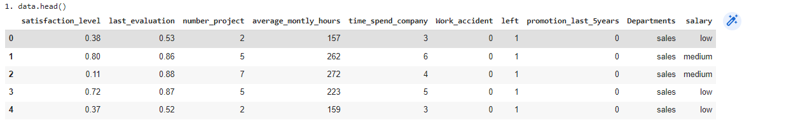
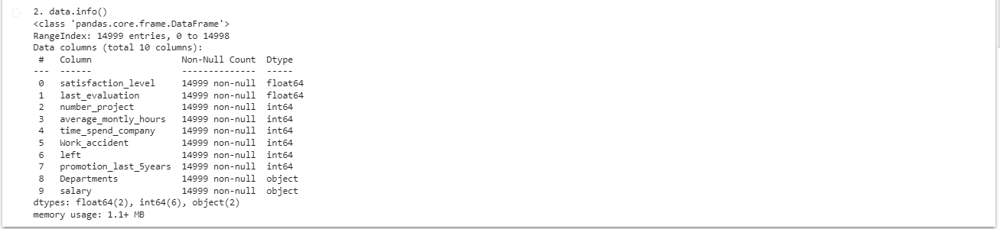
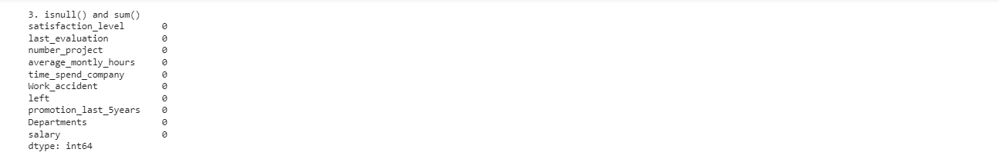
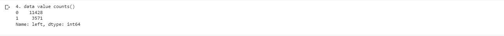
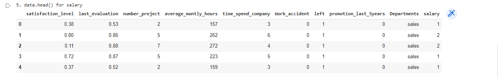
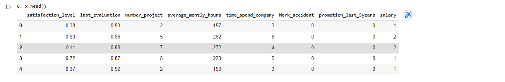
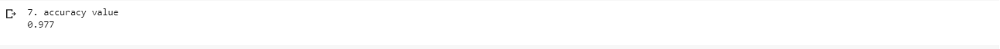
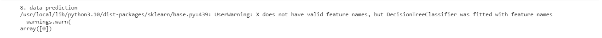

# Implementation-of-Decision-Tree-Classifier-Model-for-Predicting-Employee-Churn

## AIM:
To write a program to implement the Decision Tree Classifier Model for Predicting Employee Churn.

## Equipments Required:
1. Hardware – PCs
2. Anaconda – Python 3.7 Installation / Jupyter notebook

## Algorithm
1. Import dataset and print the dataset info
2. Check for null value
3. Map numerical for salary feature
4. Assign x and y values
5. Split as training data and test data
6. Import decision tree classifier and fit it in the dataset
7. Find accuracy and predict the values

## Program:
```
/*
Program to implement the Decision Tree Classifier Model for Predicting Employee Churn.
Developed by: Sowjanya S
RegisterNumber:  212220040158
*/

import pandas as pd
data=pd.read_csv('/content/Employee.csv')

print("1. data.head()")
data.head()

print("2. data.info()")
data.info()

print("3. isnull() and sum()")
data.isnull().sum()

print("4. data value counts()")
data["left"].value_counts()

from sklearn.preprocessing import LabelEncoder
le=LabelEncoder()
data["salary"]=le.fit_transform(data["salary"])

print("5. data.head() for salary")
data.head()

x=data[["satisfaction_level","last_evaluation","number_project","average_montly_hours","time_spend_company","Work_accident","promotion_last_5years","salary"]]

print("6. x.head()")
x.head()

y=data["left"]
from sklearn.model_selection import train_test_split
x_train,x_test,y_train,y_test=train_test_split(x,y,test_size=0.2,random_state=10)

from sklearn.tree import DecisionTreeClassifier
dt=DecisionTreeClassifier(criterion="entropy")
dt.fit(x_train,y_train)
y_pred=dt.predict(x_test)
from sklearn import metrics
accuracy=metrics.accuracy_score(y_test,y_pred)
print("7. accuracy value")
accuracy

print("8. data prediction")
dt.predict([[0.5,0.8,9,260,6,0,1,2]])
```

## Output:









## Result:
Thus the program to implement the  Decision Tree Classifier Model for Predicting Employee Churn is written and verified using python programming.
